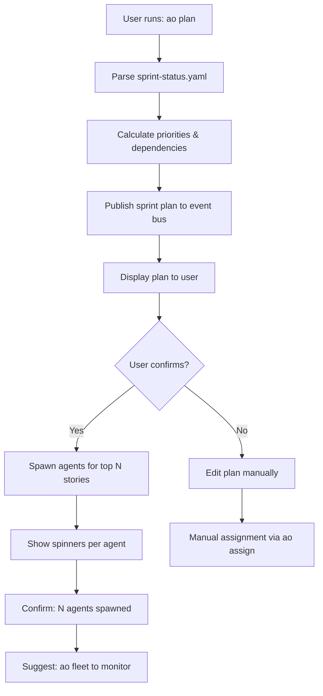
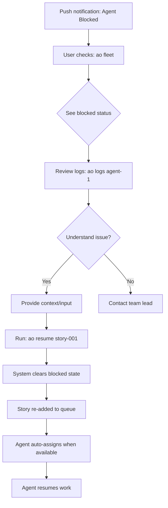
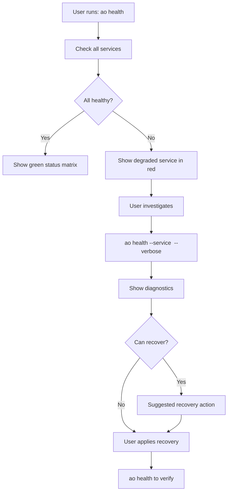

# UX Design Specification: Agent Orchestrator

**Author:** R2d2
**Date:** 2026-03-05

---

<!-- UX design content will be appended sequentially through collaborative workflow steps -->

## Executive Summary

### Project Vision

Agent Orchestrator is an open-source system for orchestrating parallel AI coding agents. 
It manages agent session lifecycles, tracks PR/CI/review state, automatically handles 
routine issues, and pushes notifications to humans only when judgment is needed. 

**Core principle**: "Push, not pull" — spawn agents, walk away, get notified when your 
judgment is needed.

This architecture extends Agent Orchestrator with BMAD (Business Management & Development) 
workflow orchestration, enabling sprint planning with automatic agent spawning, bidirectional 
state synchronization, multi-agent coordination, and real-time dashboard monitoring.

**Development Philosophy**: CLI-first with terminal-native workflows, dashboard deferred 
to Phase 2. The system is built by developers, for developers.

### Target Users

**Primary Personas:**

| Persona | Role | Goals | Pain Points |
|---------|------|-------|-------------|
| **Product Manager** | Sprint planning, assignment efficiency | Create sprint plans, auto-assign stories | Manual story tracking, no visibility into agent work |
| **Developer** | Feature implementation | Focus on coding, not coordination | Context switching to check status |
| **Tech Lead** | Fleet oversight, quality | Monitor all agents, resolve conflicts | No visibility into fleet health |
| **DevOps Engineer** | System reliability | Ensure 99.5% uptime, handle failures | No alerting on degraded services |
| **QA Engineer** | Quality validation | Track story completion, run tests | Manual status checking |

**User Characteristics:**
- Highly technical (developers, devops, QA)
- Comfortable with CLI and terminal interfaces
- Familiar with agile/sprint workflows
- Value automation and efficiency
- Need real-time visibility without constant checking

### Key Design Challenges

**1. Terminal-to-Dashboard Bridge**
CLI-first users need terminal-native workflows, but dashboard provides critical visualization. 
How do we make both interfaces feel cohesive rather than disconnected?

**2. Real-time Information Density**
"Mission control" dashboard with fleet monitoring, burndown charts, agent status cards, and logs. 
How do we present dense information without overwhelming users?

**3. Push vs Pull Notification Balance**
System pushes notifications when human judgment needed, but users also need to pull status. 
How do we prevent notification fatigue while ensuring nothing critical is missed?

**4. Multi-Agent Complexity**
10+ concurrent agents working on different stories. How do we visualize fleet activity 
without cognitive overload?

### Design Opportunities

**1. Terminal-Native Visualizations**
ASCII art burndown charts, color-coded status tables, inline notification banners. 
CLI doesn't have to be plain text.

**2. Progressive Disclosure in Dashboard**
Start with fleet overview (green/red/yellow), drill down to agent details, then full logs. 
Let users choose their depth.

**3. Contextual Notifications**
Desktop notifications for critical issues, in-app banner for warnings, log-only for info. 
Channel notification type to urgency.

**4. "Glanceable" Metrics**
Status cards that convey everything needed at a glance (agent name, story, status, runtime, 
last activity). One-second comprehension goal.

---

## Core User Experience

### Defining Experience

**Primary Interaction Loop:**

The core user experience centers on **"Fire and forget" orchestration**:

1. **Plan Sprint** → `ao plan` generates sprint plan with story assignments
2. **Spawn Agents** → Agents start automatically or via `ao spawn`
3. **Walk Away** → Users work on other tasks, system runs autonomously
4. **Get Notified** → Push notifications only when human judgment needed
5. **Resolve & Resume** → Quick intervention via `ao resume`, system continues

**Key Differentiator:** Unlike manual task boards or CI dashboards that require constant polling, Agent Orchestrator pushes notifications at the exact moment of need. Users focus on development while the system handles coordination.

**Most Frequent User Actions:**

| Action | Command | Frequency | Purpose |
|--------|---------|-----------|---------|
| Status check | `ao status` | Multiple times/day | Quick sprint health |
| Fleet check | `ao fleet` | Hourly | Agent capacity monitoring |
| Story resume | `ao resume <story>` | As needed | Unblock stuck agents |
| Health check | `ao health` | Daily/degraded | Service availability |

### Platform Strategy

**Multi-Interface Approach:**

| Interface | Phase | Primary Use | Technology |
|-----------|-------|-------------|------------|
| **CLI** | Phase 1 (MVP) | Daily operations, agent spawning | Commander.js, Node.js |
| **Web Dashboard** | Phase 2 | Fleet monitoring, burndown visualization | Next.js 15, React 19 |
| **Desktop Notifications** | Phase 1 | Critical alerts, blocked agents | node-notifier |

**Keyboard-First Design:**
- All primary actions available via terminal
- Dashboard accessible via keyboard shortcuts
- Mouse optional for core workflows

**Platform Constraints:**
- **Node.js ≥20.0.0** required (ESM, plugin system)
- **Redis** for event bus and coordination
- **tmux/process/Docker** runtime support
- **Graceful degradation** when services unavailable

### Effortless Interactions

**Zero-Thought Interactions:**

1. **`ao status`** — Single command reveals:
   - Sprint progress (completed/remaining stories)
   - Active agents with status
   - Blocked stories requiring attention
   - System health indicators

2. **Push Notifications** — Automatic alerts for:
   - Agent blocked (requires human judgment)
   - Conflict detected (multiple agents on same story)
   - Service degraded (BMAD/event bus unavailable)
   - Queue depth exceeded (too many stories waiting)

3. **Auto-Assignment** — Stories automatically assigned to idle agents:
   - Priority queue ensures highest-priority work first
   - Skill-based routing matches agent capabilities to story tags
   - Dependency resolution unblocks stories when prerequisites complete

**Eliminated Steps:**

| Manual Task | Agent Orchestrator |
|-------------|-------------------|
| Polling "Is agent done?" | Notification on completion |
| Manual story assignment | Auto-assign from queue |
| Editing YAML manually | Write-through cache |
| Checking CI status | Integrated notifications |
| Conflict detection | Auto-reassign + notify |

### Critical Success Moments

**Make-or-Break User Flows:**

1. **First-Time Success**
   - User runs: `ao spawn --story story-001`
   - **Success criteria**: Agent starts, shows story context, begins work
   - **Failure mode**: Silent failure, agent crashes, unclear error

2. **Sprint Planning**
   - User runs: `ao plan`
   - **Success criteria**: Stories prioritized, agents spawned, work begins
   - **Failure mode**: Stories missing, wrong assignments, no visibility

3. **Blocked Agent Recovery**
   - User receives: Desktop notification "Agent blocked on story-005"
   - User runs: `ao resume story-005`
   - **Success criteria**: Agent resumes, continues work
   - **Failure mode**: Unclear why blocked, no resolution path

4. **End-of-Sprint Completion**
   - User views: `ao status` or dashboard burndown
   - **Success criteria**: All stories complete, zero manual intervention needed
   - **Failure mode**: Silent failures, incomplete stories, no notification

**"This is Better" Moment:**

First time a user spawns 5 agents in parallel, walks away for 2 hours, returns to find 3 stories completed and 2 notifications for issues requiring judgment — vs manual checking of 5 separate tasks across GitHub, CI, and sprint board.

### Experience Principles

**Guiding Principles for All UX Decisions:**

1. **Push, Don't Pull** — Users should never poll. The system pushes notifications at the exact moment human judgment is needed. CLI commands are available for on-demand status, but the primary model is asynchronous notification.

2. **One-Command Visibility** — Single commands (`ao status`, `ao fleet`, `ao health`) provide complete overview. No drilling through multiple screens or running several commands to answer basic questions. One-second comprehension goal.

3. **Terminal-Native Visuals** — CLI doesn't mean plain text. Use ANSI color codes for status indicators, ASCII art for burndown charts, inline banners for notifications. Terminal users deserve rich visual feedback.

4. **Graceful Degradation** — System functions when services are unavailable. CLI works when dashboard is down. Operations queue when BMAD tracker is offline. Automatic retry with exponential backoff. Users see degradation alerts, not silent failures.

---

## Desired Emotional Response

### Primary Emotional Goals

**Core Emotional Goal: "Unburdened Productivity"**

Users should feel liberated from manual coordination tasks while maintaining full control and visibility. The system handles the complexity so developers can focus on what they do best — coding.

**Emotional Value Proposition:**

"Spawn agents, walk away, get notified only when your judgment is needed. 
Stop polling, start developing."

### Emotional Journey Mapping

| Stage | Desired Feeling | Design Touchpoints |
|-------|----------------|-------------------|
| **Discovery** | Curious → Impressed | Clear value prop, quick demo |
| **First Use** | Confident | Instant feedback, clear success criteria |
| **Core Experience** | Calm focus | Push notifications, no interruptions |
| **Task Completion** | Satisfied → Efficient | Sprint metrics, completion summary |
| **Error Recovery** | Informed, not panicked | Actionable errors, clear next steps |
| **Return Usage** | Eager confidence | Consistent experience, reliable results |

**First-Time Emotional Arc:**

1. **Skepticism** → "Will this actually work?"
2. **Validation** → Agent spawns, shows context, begins work
3. **Surprise** → "It's actually working on its own"
4. **Relief** → Notification: "Agent blocked on story-005, needs your input"
5. **Confidence** → `ao resume story-005` → agent resumes
6. **Delight** → Sprint completes with minimal intervention

### Micro-Emotions

| Micro-Emotion | Priority | Design Manifestation |
|---------------|----------|---------------------|
| **Confidence** | Critical | Real-time status, transparent logs, clear errors |
| **Relief** | Critical | No polling needed, auto-assignment, graceful degradation |
| **Control** | Critical | Manual override commands, kill switch, intervention paths |
| **Trust** | Critical | Audit trail, conflict detection, backup/restore |
| **Accomplishment** | Critical | Sprint burndown, completion metrics, fleet health |
| **Curiosity** | Secondary | Fleet monitoring, agent session cards, drill-down logs |

**Emotions to Prevent:**

| Negative Emotion | Prevention Strategy |
|------------------|---------------------|
| **Confusion** | One-command visibility, color-coded status, inline help |
| **Anxiety** | Degradation alerts, auto-retry, health checks, backup restore |
| **Frustration** | Clear error messages with actions, `--help` everywhere |
| **Helplessness** | `ao resume`, `ao logs`, `ao health` commands |

### Design Implications

**Emotion → Design Connections:**

| Emotion | UX Design Decisions |
|---------|---------------------|
| **Confidence** | • Real-time status indicators (`ao fleet` shows all agents)<br>• Transparent logs (`ao logs agent-3` reveals everything)<br>• Clear error messages with actionable next steps |
| **Relief** | • Push notifications (desktop/Slack/webhook)<br>• Auto-assignment from priority queue<br>• Graceful degradation (queues operations when services down)<br>• Automatic retry with exponential backoff |
| **Control** | • Manual override: `ao assign story-001 agent-2`<br>• Intervention: `ao resume story-005`<br>• Kill switch: `ao kill agent-3`<br>• Configuration: `agent-orchestrator.yaml` |
| **Trust** | • JSONL audit trail for all state transitions<br>• Conflict detection: multiple agents on same story<br>• Backup/restore for corrupted YAML<br>• Health monitoring: `ao health` shows service status |
| **Accomplishment** | • Sprint burndown charts (ASCII or dashboard)<br>• Completion metrics: "10 stories, 0.8 story-points/day"<br>• Fleet status: "5 agents, 3 working, 2 idle"<br>• Conflict resolution history |

**Preventing Negative Emotions:**

| Negative Emotion | UX Prevention |
|------------------|---------------|
| **Confusion** | One-second comprehension: `ao status` shows everything<br>Color-coded: 🟢 working, 🟡 idle, 🔴 blocked<br>Inline help: all commands have `--help` |
| **Anxiety** | Degradation banner: "BMAD tracker unavailable, queuing updates"<br>Auto-retry: "Retrying in 2s... 4s... 8s..."<br>Health check: `ao health` shows all services<br>Backup: "Restored from backup: story-001.backup.1741123120000" |
| **Frustration** | Error with action: "Agent blocked: ao resume story-005"<br>Debug path: "ao logs agent-3 --tail for details"<br>Diagnostics: "ao health --verbose for system status" |
| **Helplessness** | Resume command: `ao resume story-005` clears blocked state<br>Log access: `ao logs agent-3` shows agent activity<br>Manual assign: `ao assign story-001 agent-2` forces assignment |

### Emotional Design Principles

**Guiding Principles for Emotional Design:**

1. **Always Show State** — Never leave users wondering "what's happening?" Real-time status, transparent logs, clear indicators.

2. **Errors Are Actions** — Every error message includes an actionable next step. No dead ends.

3. **Push, Don't Poll** — Notifications arrive when needed. No anxiety from constant checking.

4. **Graceful Everything** — Services fail gracefully. Operations queue automatically. Users see degradation alerts, not silent failures.

5. **One-Second Clarity** — `ao status`, `ao fleet`, `ao health` — complete overview in one second. No drilling required for basic questions.

6. **Trust Through Transparency** — JSONL audit trail, visible logs, backup restore. Users can see exactly what the system is doing.

7. **Control Always Available** — Auto-automation is great, but manual override is always one command away.

---

## UX Pattern Analysis & Inspiration

### Inspiring Products Analysis

**Terminal UIs: htop, tmux**

| Aspect | Pattern | Why It Works |
|--------|---------|--------------|
| **Status Indicators** | Color-coded bars (green → yellow → red) | Instant comprehension of system load |
| **Layout** | Hierarchical: CPU | Mem | Swap | Tasks | Information density without overwhelm |
| **Real-time Updates** | Auto-refresh every 3s (configurable) | No polling needed, always current |
| **Interactivity** | Arrow keys to navigate, F-keys for actions | Keyboard-first, mouse never needed |
| **Process Listing** | Sortable columns, filterable | Find what you need quickly |
| **Visual Encoding** | Progress bars, meter graphs | Perceive values faster than reading numbers |

**GitHub Actions / CI Dashboards:**

| Aspect | Pattern | Why It Works |
|--------|---------|--------------|
| **Status Indicators** | ✅ Green / ⏳ Yellow / ❌ Red | Universal symbols, color association |
| **Progressive Disclosure** | Summary → Click job → Click step → View logs | Glance overview, drill when needed |
| **Auto-Refresh** | Running jobs update automatically | No manual refresh needed |
| **Log Streaming** | Real-time log output for running jobs | Transparency into what's happening |
| **Rerun Controls** | "Re-run all jobs" / "Re-run failed jobs" | One-click recovery from failures |
| **Timing Info** | Duration per job, total workflow time | Set expectations for completion |

### Transferable UX Patterns

**From Terminal UIs:**

| Pattern | Agent Orchestrator Adaptation |
|---------|------------------------------|
| **Color-coded status bars** | Agent status: 🟢 working / 🟡 idle / 🔴 blocked |
| **Real-time auto-refresh** | `ao fleet` updates every 5s via SSE |
| **Keyboard-first navigation** | All commands accessible via CLI, keyboard shortcuts in dashboard |
| **Hierarchical layout** | Fleet → Agents → Stories → Logs |
| **Visual encoding** | ASCII progress bars for sprint burndown |
| **Process listing** | `ao fleet` table sortable by status, runtime, story |

**From CI Dashboards:**

| Pattern | Agent Orchestrator Adaptation |
|---------|------------------------------|
| **✅⏳❌ Status symbols** | Story completion, agent status, system health |
| **Progressive disclosure** | Fleet overview → Agent card → Story details → Agent logs |
| **Auto-refresh running agents** | SSE updates for active agents (≤3s latency) |
| **Log streaming** | `ao logs agent-3 --tail` for real-time agent output |
| **One-click recovery** | `ao resume story-005` unblocks stuck agents |
| **Timing info** | Agent runtime, story completion time, sprint velocity |

### Anti-Patterns to Avoid

**From Terminal UI Failures:**

| Anti-Pattern | Why Avoid | Agent Orchestrator Solution |
|--------------|-----------|---------------------------|
| **Static output** | User doesn't know if stale | Auto-refresh or timestamp |
| **No context on errors** | "Error: failed" with no details | Error with action: `ao logs agent-3` |
| **Cluttered interfaces** | Too much information at once | One-command summaries with drill-down |
| **Hidden features** | Power users only know secrets | `--help` on every command, visible shortcuts |

**From CI Dashboard Failures:**

| Anti-Pattern | Why Avoid | Agent Orchestrator Solution |
|--------------|-----------|---------------------------|
| **Silent failures** | Job fails silently, no notification | Push notification on agent block |
| **No visibility into queue** | "Is my job running?" | `ao queue` shows story queue |
| **Manual refresh required** | Stale data until user refreshes | SSE auto-update (≤2s for burndown) |
| **Lost logs after completion** | Can't see what happened | JSONL audit trail, `ao logs --since` |

### Design Inspiration Strategy

**What to Adopt:**

1. **htop-style color-coded status table** — `ao fleet` shows all agents with 🟢🟡🔴 indicators
2. **GitHub Actions progressive disclosure** — Summary → Agent → Story → Logs
3. **tmux-style status bar** — CLI footer shows: Sprint progress | Active agents | System health
4. **CI auto-refresh pattern** — SSE updates for real-time dashboard (Phase 2)

**What to Adapt:**

1. **htop process listing** → Agent registry with sortable columns (status, runtime, story)
2. **CI log streaming** → `ao logs agent-3 --tail` with real-time output
3. **GitHub rerun controls** → `ao resume story-005` for blocked agents
4. **tmux pane management** → Dashboard split view (fleet + agent cards) in Phase 2

**What to Avoid:**

1. **Manual refresh buttons** — Use SSE/push for automatic updates
2. **Silent failures** — Always notify on agent block/failure
3. **Static output** — Always show timestamps or last-updated
4. **Hidden commands** — `--help` everywhere, visible command hints

---

## Design System Foundation

### 1.1 Design System Choice

**CLI (Phase 1): Custom Style Guide + Terminal Libraries**

- **chalk** — ANSI color codes for status indicators
- **cli-table3** — Table formatting for `ao fleet`, `ao status`
- **ora** — Spinners for agent spawning
- Custom defined color palette matching dashboard

**Dashboard (Phase 2): shadcn/ui + Tailwind CSS**

- shadcn/ui component library (copy-paste React components)
- Tailwind CSS 4.0.0 (already integrated)
- Radix UI primitives (accessibility)
- TypeScript-first, fully customizable

### Rationale for Selection

**CLI Approach:**

| Factor | Decision | Reason |
|--------|----------|--------|
| **Library Choice** | chalk, cli-table3, ora | Battle-tested, minimal dependencies |
| **Custom Style Guide** | Define ANSI codes, table formats | Consistency across commands, brand identity |
| **Speed** | Ready-made libraries, minimal config | 2-week CLI MVP timeline |

**Dashboard Approach:**

| Factor | Decision | Reason |
|--------|----------|--------|
| **Component Library** | shadcn/ui | Copy-paste components, no "black box" |
| **Styling** | Tailwind CSS 4.0.0 | Already integrated, matches CLI tokens |
| **Accessibility** | Radix UI primitives | WCAG compliance out of the box |
| **TypeScript** | First-class support | Matches codebase patterns |
| **Open Source** | OSS-friendly license | Easy for contributors |

**Shared Design Tokens:**

```typescript
// Shared between CLI and dashboard
const DESIGN_TOKENS = {
  status: {
    success: '#22c55e',  // green-500 (🟢)
    warning: '#eab308',  // yellow-500 (🟡)
    error: '#ef4444',    // red-500 (🔴)
    info: '#3b82f6',     // blue-500
    idle: '#6b7280',     // gray-500
  },
  agents: {
    working: '#22c55e',  // 🟢
    blocked: '#ef4444',  // 🔴
    idle: '#eab308',     // 🟡
    offline: '#6b7280',  // ⚫
  },
};
```

### Implementation Approach

**Phase 1 (CLI MVP):**

```typescript
// packages/cli/src/utils/format.ts
import chalk from 'chalk';
import Table from 'cli-table3';

// Custom CLI style guide
export const COLORS = {
  success: chalk.green('✓'),
  error: chalk.red('✗'),
  warning: chalk.yellow('⚠'),
  info: chalk.blue('ℹ'),
  agent: {
    working: chalk.green('●'),
    blocked: chalk.red('●'),
    idle: chalk.yellow('○'),
    offline: chalk.gray('○'),
  },
};

export function formatFleetTable(agents: Agent[]) {
  return new Table({
    head: ['Agent', 'Status', 'Story', 'Runtime', 'Last Seen'],
    colWidths: [15, 10, 30, 10, 15],
  });
}
```

**Phase 2 (Dashboard):**

```typescript
// packages/web/components/ui/status-badge.tsx
import { cva, type VariantProps } from 'class-variance-authority';

// shadcn/ui component with design tokens
export const statusBadgeVariants = cva(
  'inline-flex items-center rounded-full px-2 py-1 text-xs font-medium',
  {
    variants: {
      status: {
        working: 'bg-green-100 text-green-800 dark:bg-green-900 dark:text-green-200',
        blocked: 'bg-red-100 text-red-800 dark:bg-red-900 dark:text-red-200',
        idle: 'bg-yellow-100 text-yellow-800 dark:bg-yellow-900 dark:text-yellow-200',
        offline: 'bg-gray-100 text-gray-800 dark:bg-gray-900 dark:text-gray-200',
      },
    },
  }
);
```

**CLI → Dashboard Visual Parity:**

| Element | CLI | Dashboard |
|---------|-----|-----------|
| Working agent | 🟢 green dot | Green badge with "Working" |
| Blocked agent | 🔴 red dot | Red badge with "Blocked" |
| Idle agent | 🟡 yellow circle | Yellow badge with "Idle" |
| Success | ✓ green | Green toast/banner |
| Error | ✗ red | Red error alert |

### Customization Strategy

**Design Token Hierarchy:**

```typescript
// 1. Global design tokens (shared)
// packages/core/src/config/design-tokens.ts
export const DESIGN_TOKENS = {
  colors: { /* ... */ },
  spacing: { /* ... */ },
  typography: { /* ... */ },
};

// 2. CLI-specific tokens
// packages/cli/src/utils/cli-tokens.ts
export const CLI_COLORS = {
  success: chalk.hex(DESIGN_TOKENS.colors.success),
  error: chalk.hex(DESIGN_TOKENS.colors.error),
  // ...
};

// 3. Dashboard-specific tokens
// packages/web/app/globals.css
:root {
  --color-success: 22c55e; /* matches DESIGN_TOKENS */
  --color-error: ef4444;
  --color-warning: eab308;
}
```

**Component Strategy:**

**CLI Components:**
- `formatFleetTable()` — Agent status table
- `formatBurndown()` — ASCII burndown chart
- `formatNotification()` — Inline notification banner
- `spinner` — ora spinner for agent spawning

**Dashboard Components (shadcn/ui):**
- `StatusBadge` — Agent/story status indicator
- `AgentCard` — Agent session card with drill-down
- `FleetTable` — Sortable agent list
- `NotificationBanner` — In-app notifications
- `BurndownChart` — Recharts burndown visualization

**Custom Components:**
- Terminal log viewer with syntax highlighting
- Real-time SSE connection indicator
- Keyboard shortcut help modal

---

## 2. Core User Experience

### 2.1 Defining Experience

**Core Defining Interaction: "Fire and Forget Orchestration"**

Spawn agents with story context, walk away, get notified only when human judgment is needed. The system handles coordination, status tracking, and automatic recovery. Users focus on development, not babysitting AI agents.

**User Quote They'll Share with Friends:**
> "I spawned 5 agents for my sprint, went to lunch, and came back to 3 stories completed. The system only pinged me twice when agents needed my input."

**If We Nail ONE Thing:**
Push notifications at the exact moment of need. Never make users poll for status. The system pushes when agents block, conflicts occur, or attention is required.

### 2.2 User Mental Model

**Current Mental Models (What Users Bring):**

| Metaphor | Source | Application |
|----------|--------|-------------|
| **Sprint Board** | Jira/Linear | Stories move across columns (To Do → In Progress → Done) |
| **CI Dashboard** | GitHub Actions | Green/yellow/red status, click-to-drill logs |
| **Terminal Commands** | git, kubectl | Run command, get output, run next command |
| **Process Monitor** | htop, docker ps | Table format with sortable columns, real-time updates |

**User Expectations:**
- Agent spawning should be `git push` simple
- Status should be `git status` clear (one command shows everything)
- Notifications should be `CI failed` obvious (push, don't poll)
- Blocked agents should have `git rebase --continue` clear recovery path

**Confusion Points to Address:**
- "Is my agent still working?" → Real-time status + last seen timestamp
- "What story is agent-3 working on?" → `ao fleet` shows agent→story mapping
- "Agent blocked, now what?" → Notification includes action: `ao resume story-005`

### 2.3 Success Criteria

**"This Just Works" Indicators:**

| Success Moment | User Feedback |
|---------------|---------------|
| **Agent Spawning** | Spinner → ✓ "Agent started" <10s (NFR-P4) |
| **Status Check** | `ao status` <500ms (NFR-P8) shows everything |
| **Blocked Recovery** | Notification → `ao resume` → agent resumes |
| **Sprint Complete** | "10 stories, 2 interventions" celebrated |

**Feel Smart/Accomplished When:**
- End of sprint: High completion rate with minimal manual intervention
- `ao fleet` shows healthy agents (🟢 green dots across the board)
- Sprint burndown shows on-track trajectory

**Automatic Behaviors (User Does Nothing):**
- Agent assignment from priority queue
- YAML updates when agents complete
- Dependent stories unblocked when prerequisites complete
- Notifications pushed when judgment needed

### 2.4 Novel UX Patterns

**Established Patterns Adopted:**

| Pattern | Source | Agent Orchestrator Use |
|---------|--------|------------------------|
| CLI table output | htop, docker ps | `ao fleet` table with color-coded status |
| Status indicators | GitHub Actions | 🟢🟡🔴 symbols for agent status |
| Push notifications | CI failures | Desktop/Slack/webhook alerts |
| Progressive disclosure | CI logs | Summary → Agent → Story → Logs |

**Unique Innovation:**

**Zero-Polling Model** — Unlike task boards (Jira) or CI dashboards that require manual refresh, Agent Orchestrator pushes notifications at the exact moment of need. Users never poll, never wonder "what's happening?"

**One-Command Visibility** — `ao status` shows sprint progress, active agents, blocked stories, system health in <500ms. No drilling required for basic questions.

### 2.5 Experience Mechanics

**Core Flow: Spawn and Monitor Agents**

**1. Initiation Phase:**

```bash
$ ao spawn --story story-001 --agent claude-1
⠋ Spawning claude-1 for story-001...
✓ Agent claude-1 spawned for story-001 (Implement event bus)
  Story ID: story-001
  Status: working
  Runtime: 0m 5s

Monitor with: ao fleet
View logs: ao logs claude-1
```

**UX Elements:**
- Spinner provides immediate feedback (ora library)
- Success confirmation with story context
- Suggested next actions (discoverability)

**2. Monitoring Phase (User Walks Away):**

```bash
# User returns after 2 hours, checks status:
$ ao fleet
┌──────────┬─────────┬──────────┬─────────┬────────────┐
│ Agent    │ Status  │ Story    │ Runtime │ Last Seen  │
├──────────┼─────────┼──────────┼─────────┼────────────┤
│ claude-1 │ ● blocked │ story-001│ 45m     │ 10s ago    │
│ claude-2 │ ● working │ story-002│ 12m     │ 5s ago     │
│ claude-3 │ ○ idle    │ —        │ —       │ 30s ago    │
└──────────┴─────────┴──────────┴─────────┴────────────┘

Blocked: 1 | Working: 1 | Idle: 1
Queue depth: 7 stories
```

**UX Elements:**
- Color-coded symbols (● = active, ○ = inactive)
- Status sorted by activity (working first)
- Last seen timestamp (auto-refresh every 5s)
- Summary footer (quick stats)

**3. Intervention Phase (Push Notification):**

```bash
# Desktop notification arrives:
┌─────────────────────────────────────────────┐
│ 🔴 AGENT BLOCKED                              │
│                                              │
│ Agent: claude-1                              │
│ Story: story-001 (Implement event bus)       │
│ Reason: API design unclear                   │
│ Time: 2026-03-05 10:35:00                    │
│                                              │
│ Actions:                                     │
│   ao logs claude-1      View agent logs      │
│   ao resume story-001   Resume story         │
└─────────────────────────────────────────────┘
```

**UX Elements:**
- Critical notifications use desktop/Slack (can't miss)
- Clear problem statement (what, why, when)
- Actionable next steps (no dead ends)

**4. Recovery Phase:**

```bash
$ ao resume story-001
⠋ Clearing blocked state for story-001...
✓ Story story-001 resumed
  Re-adding to queue with boosted priority
  Agent: claude-1 (will auto-assign)

# After 30s:
$ ao fleet
┌──────────┬─────────┬──────────┬─────────┬────────────┐
│ Agent    │ Status  │ Story    │ Runtime │ Last Seen  │
├──────────┼─────────┼──────────┼─────────┼────────────┤
│ claude-1 │ ● working │ story-001│ 50m     │ 5s ago     │
│ claude-2 │ ○ idle    │ story-002│ Done     │ 2m ago     │
│ claude-3 │ ○ idle    │ —        │ —       │ 30s ago    │
└──────────┴─────────┴──────────┴─────────┴────────────┘
```

**UX Elements:**
- Spinner during resume (provides feedback)
- Confirmation with next action (will auto-assign)
- Status table shows agent back to work

**5. Completion Phase:**

```bash
# Notification arrives:
✓ Story story-001 completed by claude-1 (Implement event bus)

# User verifies:
$ ao status
Sprint Progress: ██████████ 100% (10/10 stories)
Active Agents: 0 idle
Completed: 10 | Blocked: 0

Stories completed this sprint:
  ✓ story-001 Implement event bus (claude-1, 45m)
  ✓ story-002 Add auth middleware (claude-2, 12m)
  ... (8 more stories)

Total time: 2h 15m
Manual interventions: 2 (story-001, story-005)
```

**UX Elements:**
- Completion notification celebrates success
- Sprint progress shows 100% with visual bar
- Summary with metrics (time, interventions)
- Full story list with agent + duration

---

## Visual Design Foundation

### Color System

**Semantic Color Palette:**

| Purpose | Color | Hex | Tailwind | CLI Symbol |
|---------|-------|-----|---------|------------|
| **Success / Working** | Green | #22c55e | green-500 | 🟢 ● |
| **Warning / Idle** | Yellow | #eab308 | yellow-500 | 🟡 ○ |
| **Error / Blocked** | Red | #ef4444 | red-500 | 🔴 ● |
| **Info** | Blue | #3b82f6 | blue-500 | ℹ |
| **Neutral** | Gray | #6b7280 | gray-500 | ○ |

**Color Usage Guidelines:**

- **Green**: Agents working, stories completed, system healthy
- **Yellow**: Agents idle, warnings, queue depth alert
- **Red**: Agents blocked, errors, conflicts, service degraded
- **Blue**: Informational messages, neutral states
- **Gray**: Offline, completed, neutral

**Accessibility:**
- All color combinations meet WCAG AA (4.5:1 contrast)
- Status indicators use symbols + colors (colorblind-friendly)
- Monochrome version works (symbols alone convey meaning)

### Typography System

**Dashboard Typography:**

| Role | Font | Size | Weight |
|------|------|------|--------|
| **H1** | Inter/system-ui | 24px (text-2xl) | 600 (semibold) |
| **H2** | Inter/system-ui | 20px (text-xl) | 600 (semibold) |
| **H3** | Inter/system-ui | 18px (text-lg) | 500 (medium) |
| **Body** | Inter/system-ui | 14px (text-sm) | 400 (regular) |
| **Code/Mono** | JetBrains Mono/Fira Code | 14px (text-sm) | 400 (regular) |

**CLI Typography:**
- User's terminal monospace (not controlled)
- ANSI colors via chalk for emphasis
- Unicode symbols for status (●, ○, ✓, ✗, ⚠)

**Font Fallback Chain:**
```css
font-family: 'Inter', system-ui, -apple-system, BlinkMacSystemFont, sans-serif;
font-mono: 'JetBrains Mono', 'Fira Code', 'SF Mono', 'Monaco', 'Cascadia Code', monospace;
```

### Spacing & Layout Foundation

**Spacing Scale (Tailwind default, 4px base):**

| Token | Value | Usage |
|-------|-------|-------|
| `p-2` | 8px | Card padding (tight) |
| `p-4` | 16px | Card padding (comfortable) |
| `gap-2` | 8px | Element spacing |
| `gap-4` | 16px | Section spacing |
| `gap-6` | 24px | Component separation |

**Layout Principles:**

1. **Information-Dense but Scannable**
   - htop-style tables with multiple columns
   - Progressive disclosure (summary → drill-down)
   - One-second comprehension goal

2. **Consistent Visual Hierarchy**
   - Status indicators left-aligned
   - Actions right-aligned
   - Metadata (timestamps, runtime) smaller/lighter

3. **Responsive Grid System**
   - Fleet monitoring: 3-column grid (agent cards)
   - Dashboard: Sidebar (queue) + Main (fleet) + Detail (logs)
   - Mobile: Single column, stacked

**Component Spacing:**

```typescript
// Agent card spacing
const AGENT_CARD_SPACING = {
  header: 'p-4 gap-2',        // Agent name, status badge
  body: 'p-4 gap-4',          // Story, runtime, actions
  footer: 'p-2 border-t'      // Timestamp, last seen
};

// Table spacing (CLI)
const TABLE_SPACING = {
  padding: 2,                 // Cell padding
  colWidths: [15, 10, 30, 10, 15],  // Agent, Status, Story, Runtime, Last Seen
  separator: '│'              // Column separator
};
```

### Accessibility Considerations

**Color Accessibility:**

- All text meets WCAG AA (4.5:1 contrast ratio)
- Color + symbols dual coding (colorblind-friendly)
- Focus indicators on all interactive elements
- Keyboard navigation support (tab index)

**CLI Accessibility:**

- High contrast colors for status indicators
- Unicode symbols + colors (redundant encoding)
- Clear table headers and separators
- --help flags on all commands

**Dashboard Accessibility (Phase 2):**

- ARIA labels for icon-only buttons
- Keyboard shortcuts displayed in help modal
- Focus traps for modals
- Skip links for main content

**Testing:**
- Playwright accessibility tests
- Manual keyboard navigation testing
- Color contrast validator

---

## Design Direction Decision

### Design Directions Explored

**Direction 1: Terminal-Native "htop Style" (CLI Focus)**
- Dense information display with table formatting
- Color-coded status indicators (🟢🟡🔴)
- Real-time updates with timestamps
- Minimal chrome, maximum data
- htop/docker ps inspiration

**Direction 2: "Mission Control" Dashboard (Dashboard Focus)**
- Three-column grid layout (fleet monitoring)
- Card-based agent sessions with status indicators
- Real-time SSE updates
- Progressive disclosure (overview → drill-down)
- Grafana/Datadog inspiration

**Direction 3: Hybrid "CLI + Dashboard" (Balanced)**
- CLI for core operations (spawn, status, resume)
- Dashboard for visualization (burndown, fleet matrix)
- Consistent visual language across both
- Users can stay in terminal or use dashboard as needed

### Chosen Direction

**Phase 1 (CLI MVP): Direction 1 — Terminal-Native**

- Focus on CLI excellence with table formatting and color-coded indicators
- One-command visibility (`ao status`, `ao fleet`)
- Push notifications for critical events
- htop-style information density

**Phase 2 (Dashboard): Direction 2 — Mission Control**

- Three-column grid with fleet monitoring matrix
- Agent session cards with drill-down logs
- Real-time SSE updates for live data
- Burndown charts and sprint metrics

**Hybrid Integration:**
- CLI and dashboard share design tokens (colors, symbols)
- Both support same core operations (status, spawn, resume)
- Users can choose interface based on context

### Design Rationale

**Why Terminal-Native for CLI MVP:**
1. **Target User Comfort** — Developers prefer terminal interfaces
2. **Speed to Implement** — 2-week MVP timeline
3. **Proven Patterns** — htop, docker ps, kubectl get pods
4. **No Framework Overhead** — Pure CLI, no web dependencies

**Why Mission Control for Dashboard:**
1. **Information Density** — "Mission control" matches fleet monitoring needs
2. **Real-Time Updates** — SSE for live agent status
3. **Progressive Disclosure** — Overview → Agent → Story → Logs
4. **Proven Patterns** — Grafana, Datadog, GitHub Actions

### Implementation Approach

**CLI Implementation (Phase 1):**

```typescript
// packages/cli/src/commands/fleet.ts
import Table from 'cli-table3';
import chalk from 'chalk';

export function formatFleetTable(agents: Agent[]) {
  const table = new Table({
    head: [
      chalk.cyan('Agent'),
      chalk.cyan('Status'),
      chalk.cyan('Story'),
      chalk.cyan('Runtime'),
      chalk.cyan('Last Seen'),
    ],
    colWidths: [15, 10, 30, 10, 15],
    chars: { 'mid': '│', 'left': '│', 'right': '│' },
  });

  agents.forEach(agent => {
    table.push([
      agent.name,
      formatStatus(agent.status),
      agent.story || '—',
      formatRuntime(agent.runtime),
      formatLastSeen(agent.lastSeen),
    ]);
  });

  return table.toString();
}

function formatStatus(status: AgentStatus): string {
  switch (status) {
    case 'working': return chalk.green('● working');
    case 'blocked': return chalk.red('● blocked');
    case 'idle': return chalk.yellow('○ idle');
    case 'offline': return chalk.gray('○ offline');
  }
}
```

**Dashboard Implementation (Phase 2):**

```typescript
// packages/web/components/FleetMonitoring.tsx
'use client';

export function FleetMonitoring() {
  return (
    <div className="grid grid-cols-3 gap-4 p-4">
      {/* Story Queue Sidebar */}
      <StoryQueueSidebar />

      {/* Fleet Monitoring Matrix */}
      <div className="col-span-2">
        <div className="grid grid-cols-3 gap-4">
          {agents.map(agent => (
            <AgentCard key={agent.id} agent={agent} />
          ))}
        </div>
      </div>

      {/* Agent Details Panel (drill-down) */}
      <AgentDetailsPanel />
    </div>
  );
}

// shadcn/ui component
function AgentCard({ agent }: { agent: Agent }) {
  return (
    <Card className="p-4">
      <div className="flex items-center justify-between mb-2">
        <h3 className="font-mono text-sm">{agent.name}</h3>
        <StatusBadge status={agent.status} />
      </div>
      <p className="text-sm text-gray-600">{agent.story}</p>
      <div className="flex items-center gap-4 mt-2 text-xs">
        <span>Runtime: {agent.runtime}</span>
        <span>Last seen: {agent.lastSeen}</span>
      </div>
    </Card>
  );
}
```

**Shared Design Tokens:**

```typescript
// packages/core/src/config/design-tokens.ts
export const DESIGN_TOKENS = {
  colors: {
    success: '#22c55e',  // 🟢 green-500
    warning: '#eab308',  // 🟡 yellow-500
    error: '#ef4444',    // 🔴 red-500
    info: '#3b82f6',     // ℹ blue-500
    neutral: '#6b7280',  // ○ gray-500
  },
  cli: {
    success: chalk.hex('#22c55e'),
    error: chalk.hex('#ef4444'),
    warning: chalk.hex('#eab308'),
  },
  dashboard: {
    success: 'bg-green-100 text-green-800',
    error: 'bg-red-100 text-red-800',
    warning: 'bg-yellow-100 text-yellow-800',
  },
};
```

---

## User Journey Flows

### Journey 1: Sprint Planning & Agent Spawning

**User Persona:** Product Manager
**Goal:** Create sprint plan and spawn agents for all stories

**Flow Diagram:**



**Key Interactions:**
- `ao plan` — Generates plan from YAML
- User confirmation — "Proceed with this plan? (y/n)"
- `ao spawn` — Spawns agents with story context
- `ao fleet` — Monitor agent status

**Success Criteria:**
- All stories assigned within 10s (NFR-P4)
- User sees clear confirmation
- Knows how to monitor progress

**Error Recovery:**
- Spawn fails: Error + `ao logs agent-X`
- BMAD unavailable: Queue + retry
- Insufficient agents: Warning + manual assignment

### Journey 2: Blocked Story Recovery

**User Persona:** Developer / Product Manager
**Goal:** Resolve blocked agent and resume work

**Flow Diagram:**



**Key Interactions:**
- Push notification (desktop/Slack)
- `ao fleet` — Check agent status
- `ao logs` — Review agent context
- `ao resume` — Clear blocked state

**Success Criteria:**
- User knows why agent blocked (logs)
- Clear recovery path (`ao resume`)
- Agent resumes automatically

### Journey 3: Fleet Health Monitoring

**User Persona:** Tech Lead / DevOps Engineer
**Goal:** Monitor system health and detect issues

**Flow Diagram:**



**Key Interactions:**
- `ao health` — All services overview
- `ao health --service <name>` — Detailed diagnostics
- Color-coded status (🟢 healthy, 🟡 degraded, 🔴 offline)

**Success Criteria:**
- One-command health overview
- Degraded services clearly marked
- Actionable recovery suggestions

### Journey Patterns

**Navigation Patterns:**
- **CLI First** — All primary actions via terminal
- **Progressive Disclosure** — Summary → Details → Drill-down
- **Command Suggestion** — "Monitor with: ao fleet" in output

**Decision Patterns:**
- **Confirmation Before Action** — `ao plan` asks "Proceed?"
- **Auto-Defaults** — Sensible defaults for common actions
- **Manual Override** — Users always have manual control

**Feedback Patterns:**
- **Immediate Feedback** — Spinners for long operations
- **Status Symbols** — 🟢🟡🔴 for instant comprehension
- **Timestamps** — "Last seen: 10s ago" for freshness
- **Action Suggestions** — Next actions in output

### Flow Optimization Principles

**Minimize Steps to Value:**
- `ao status` shows everything in one command
- `ao spawn --story story-001` — One command, instant feedback
- `ao resume story-001` — One command resolves blocked state

**Reduce Cognitive Load:**
- One-second comprehension goal for all outputs
- Color-coded status eliminates need to parse text
- Suggested next actions aid discoverability

**Clear Feedback:**
- Spinners for operations >1s
- Success confirmations (✓ Agent spawned)
- Error messages with actions (Agent blocked: ao resume)

**Delight Moments:**
- Sprint progress bar (████████░░ 80%)
- Completion celebration ("10 stories, 2 interventions")
- All agents healthy 🟢🟢🟢🟢🟢

---

# UX Design Specification - COMPLETE

**Status:** ✅ Complete

**Date:** 2026-03-05

**Project:** agent-orchestrator

---

## Document Summary

This UX Design Specification establishes the foundation for building Agent Orchestrator's user experience:

**Completed Sections:**
1. **Executive Summary** — Project vision, target users, design challenges, opportunities
2. **Core User Experience** — "Fire and forget" orchestration model
3. **Desired Emotional Response** — "Unburdened productivity" as primary emotional goal
4. **UX Pattern Analysis** — Inspired by hop/tmux and GitHub Actions
5. **Design System Foundation** — Custom CLI + shadcn/ui for dashboard
6. **Design Direction** — Terminal-native for CLI MVP, Mission Control for dashboard
7. **User Journey Flows** — Detailed flows for sprint planning, blocked recovery, health monitoring

**Key Design Decisions:**
- **CLI-first development** — 2-week MVP, dashboard Phase 2
- **Push, don't pull** — Notifications arrive when needed, no polling
- **One-command visibility** — `ao status`, `ao fleet` show everything
- **Terminal-native visuals** — Color codes, tables, ASCII charts
- **Shared design tokens** — CLI and dashboard use same colors/symbols

**Next Steps:**
1. Implement CLI commands following these UX patterns
2. Create Epics and Stories from this UX foundation
3. Begin Sprint 1 with CLI MVP development

---
